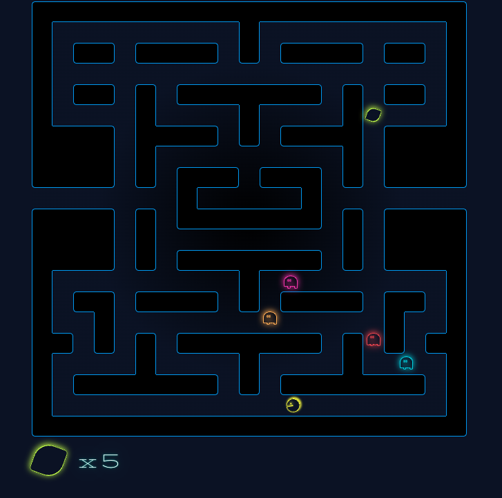

# Pacman



You can play it [here](https://virgs.github.io/pacman/)

Yeap. As you might think, this is yet another game development project of mine.
If you haven't done it yet, I highly recommend checking the other ones I have on GitHub:

- [Sudoku](https://github.com/virgs/sudoku)
- [Minesweeper AI](https://github.com/virgs/minesweeper-ai)
- [Flappy Bird AI](https://github.com/virgs/flappy-bird-ai)
- [2048 AI](https://github.com/virgs/2048-ai)
- [Rubik's Cubes AI](https://github.com/virgs/rubiks-cubes-ai)
- [Mancala](https://github.com/virgs/mancala)
- [Tetris](https://github.com/virgs/tetris)
- [Navigator's Gamble](https://github.com/virgs/navigators-gamble)

----

## Project

As you may have noticed, I like coding games. Lately, I've digging deeper and deeper about game AI.
More specifically, I've coded different games that require different AI approaches, so I can learn these AI approaches and have fun at the same time.
The AI I used on this project precisely mimics the one coded on the original game and has something to do with “graph search”
Please, note the quotes. Believe me, this is not even close to being as fancy as you might think. But I'll get there eventually.

## Goals

As usual, every time I code a new project, I impose some artificial constraints to make the coding itself both more challenging and I can learn something else as I do it. The constraints I came up with for this one were:

- Pac-man logic and its AI.
- React/HTML/CSS only. No game can be used.
- Responsiveness. It has to run smoothly on mobile devices and bigger screens.
- To be fun to play and code. I took a few poetic licenses to change a bit the playability. Especially because I never intended to create “next-levels” or anything similar, like the original game.

## Game

Now, back to business. Pac-man-related stuff!
Pac-Man stands as a timeless testament to the golden era of arcade gaming, where simplicity met innovation, creating an enduring legend that continues to captivate players with its charming simplicity and endless fun.

Pac-Man embarks on a vibrant journey through a mesmerizing maze filled with whimsical ghosts and pulsating pellets. As our circular hero navigates the labyrinthine corridors, a symphony of electronic beats accompanies each nimble move, creating a harmonious dance between the player and the pixelated protagonist.

In this kaleidoscopic realm, Pac-Man devours radiant pellets, unleashing a cascade of colors that ignite the screen. The pursuit of power-packed super pellets transforms our intrepid hero into a formidable force, allowing him to turn the tables on his spectral pursuers.

### Ghosts

The game Pac-Man (PAC-MAN or Pacman) has four ghosts that are out to destroy the “protagonist”. Named (Yes, they have names, you soulless inconsiderate creature):

1. Shadow, aka *Blinky* (red);
2. Speedy, aka *Pinky* (pink);
3. Bashful, aka *Inky* (aqua);
4. Pokey aka *Clyde* (orange);

#### Ghost states

Ghosts present four different states:

1. CHASE. The ghosts chase the hero.
2. SCATTER. The ghosts go back to their corners. Each ghost has a respective level corner to call 'mine'
3. FRIGHTENED. The ghosts randomly wander. If they touch the hero, they die.
4. DEAD. They're dead and can't kill Pac-Man until they arrive at the ghost house, in the center of the board.

Three of them are managed by the level/Pac-Man situation and the remaining one is DEAD.
The level alternates between CHASE and SCATTER wave states solely based on timing. Nothing else.  
It is CHASE state for a time, then SCATTER state, then CHASE again, and so on. This changes when Pac-Man eats a fruit, and all ghosts enter FRIGHTENED mode for a few seconds. When these seconds are gone, they go back to the CHASE/SCATTER waves. Unless when one of them touches the hero, then this single dead ghost ignores the level states until they are alive again.

These durations can change, but you can check them [here](./src/config.ts)

### Artificial Intelligence

It might go without saying, but just in case you didn't figure it out, the AI involved in coding this game was implanted into the ghosts' brains. It may be a surprise to you, as it was to me at first, but they all have different chasing strategies. It looks obvious now, otherwise, they all would end up eventually overlapping each other, essentially becoming just one ghost in practical terms. Their strategies combined are very clever, when in *chase* mode, it aims to keep cornering Pac-Man instead of just blindly chasing it.

1. *Blinky* constantly chases Pac-Man's position;
2. *Pinky* chases 4 positions ahead of Pac-Man's position considering Pac-Man current direction;
3. *Inky* has a bit trickier chasing approach:
   Consider **P** the point 2 positions ahead of Pac-Man's position considering Pac-Man current direction and **B** *Blinky's* position. *Inky* chases the point **I** where **I** is **P** + (**P** - **B**).
4. *Clyde*, as *Blinky* chases the Pac-Man position when it's 8 or more tiles away from it. Otherwise, goes back to its corner.

As I mentioned earlier, the chase mechanism is not fancy at all. Some might think of something similar to simple A*, or BFS techniques, but it is even simpler. It goes like this: every time a ghost steps into a different tile, it checks the adjacent directions and the current on. So, if the ghost is moving rightwards, it checks the UP, RIGHT, and LEFT directions. Whichever is closest to the target (in Euclidian terms) it goes.  
If there are no options - the ghost is on a dead-end, the ghost turns back. That's the only case the ghost turns back on its own. Other than that, the ghosts also turn back every time a ghost state is changed by the level (When the wave tells all ghosts that the SCATTER/CHASE/FRIGHTENED states are over). By doing so, it aids the player in identifying which wave is currently active and, thus, the player can make more informed decisions.

## Code It Yourself

To do so, you'd have to rewrite a really small portion of the code and put your ideas instead.

### Project Setup

```sh
npm install
```

#### Compile and Hot-Reload for Development

```sh
npm run dev
```

#### Type-Check, Compile, and Minify for Production

```sh
npm run build
```

#### Format

```sh
npm run format
```

## Bibliography

1. [Pac-man's ghosts' AI explained](https://youtu.be/ataGotQ7ir8?si=uz0xk3gQ8CyYhLvu)
